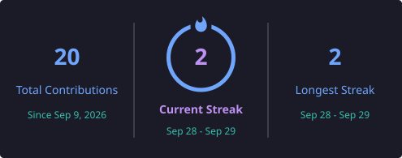

  <!-- Glowing Animated Header Badge -->
  

  <!-- Mental Animated Typing Text -->
  

  <!-- Floating Animated Tech Badges -->
  
  
  
  
  

# Hi 👋, I'm Vaishnavi Pawar

### 💻 Frontend Developer | Full-Stack Web Development Enthusiast

  

  
  

---

## 👩‍💻 About Me

I'm a passionate **Frontend Developer** interested in building modern, responsive,
and user-friendly web applications.

- 💻 I'm a **Frontend Developer**
- 🌐 I'm interested in **Full-Stack Web Development**
- 🌱 Currently learning **Python, Cloud Technologies & Web Development**
- 📚 Currently working on improving my **programming languages and technical skills**
- 💡 Interested in building **real-world web applications**
- 👯 Looking to collaborate on **Web Development & Open Source projects**
- 💬 Ask me about **HTML, CSS, JavaScript, Python, Git & GitHub**
- 📫 Reach me at **vaishnavipawarofficial06@gmail.com**
- ⚡ Fun fact: **I love turning ideas into working projects!**

---

## 🛠️ Tech Stack

### 🌐 Frontend Development

### 🐍 Programming Languages

### ☁️ Cloud & Technologies

### 🗄️ Databases

### 🔧 Tools

---
## 📊 GitHub Statistics

  
  

---

## 🔥 Contribution Streak

  

---

## 🏆 GitHub Trophies

  

---

## 📈 Contribution Activity

  

---

## 👀 Profile Views

  

---
---

## 🌱 Currently Learning

| 🚀 Area | 📚 Learning |
|:---:|:---:|
| 🎨 Frontend | HTML • CSS • JavaScript |
| ⚛️ Web Development | React.js |
| 🐍 Programming | Python |
| ☁️ Cloud | Cloud Technologies |
| 🔧 Backend | Node.js • APIs |
| 🗄️ Database | SQL • MongoDB |

---

## 💡 What I'm Working On

- 🚀 Building modern and responsive web applications
- 🌱 Improving my Full-Stack Development skills
- 🐍 Practicing Python and problem solving
- ☁️ Exploring Cloud Technologies
- 💻 Creating projects and learning through real-world development

---

## 🤝 Let's Connect

---

  <b>✨ Keep Learning • Keep Building • Keep Growing ✨</b>

  Thanks for visiting my profile! 💜

